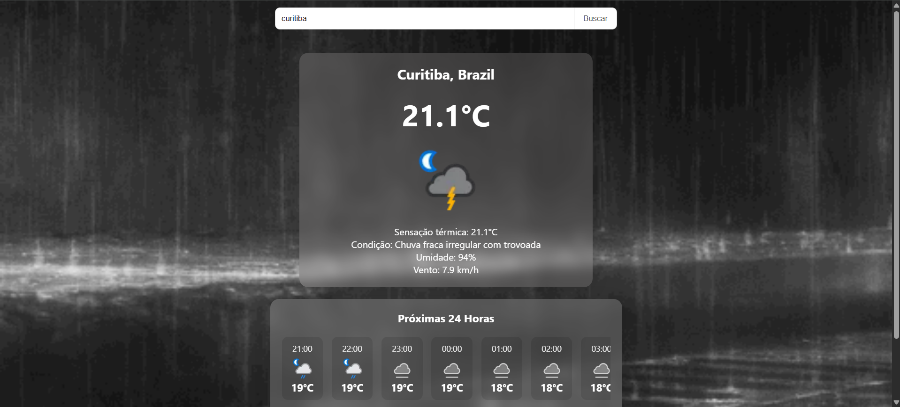

# 🌤️ Weather App (ClimaDev)


Um aplicativo web moderno e responsivo para previsão do tempo, focado na experiência do usuário e em uma interface limpa. 




O sistema consome dados de uma API externa através de um backend próprio, garantindo segurança e flexibilidade, e apresenta informações detalhadas como clima atual, previsão horária para as próximas 24 horas e previsão estendida para 3 dias.

## ✨ Funcionalidades

* **📍 Geolocalização Automática:** Detecta a localização do usuário ao abrir o app e carrega o clima local instantaneamente.
* **🔍 Busca de Cidades:** Pesquise o clima de qualquer lugar do mundo de forma rápida.
* **🎨 Backgrounds Dinâmicos:** O fundo da aplicação muda dinamicamente (cores ou vídeos/GIFs) de acordo com a condição climática atual (ex: sol, chuva, neve, tempestade).
* **⏱️ Previsão Horária (24h):** Carrossel horizontal mostrando a variação de temperatura e condições hora a hora.
* **📅 Previsão Estendida (3 Dias):** Lista expansível com animações suaves exibindo as mínimas, máximas e condições dos próximos dias.
* **📱 Design Responsivo:** Interface totalmente adaptada para funcionar perfeitamente em celulares, tablets e desktops.

## 🛠️ Tecnologias Utilizadas

**Frontend:**
* [React](https://reactjs.org/) (com Hooks: `useState`, `useEffect`)
* [TypeScript](https://www.typescriptlang.org/) para tipagem estática e maior segurança no código.
* [Vite](https://vitejs.dev/) como *bundler* para um ambiente de desenvolvimento ultra-rápido.
* CSS3 Puro (Animações de Keyframes, Flexbox, Glassmorphism).

**Backend (API Rest):**
* [NestJS](https://nestjs.com/) / Node.js *(Responsável por intermediar e limpar os dados da API de clima externa).*

## 🚀 Como Rodar o Projeto

### Pré-requisitos
* Node.js instalado na sua máquina.
* O backend do projeto (NestJS) deve estar rodando localmente na porta `3000` (ou atualize a URL no arquivo `weatherService.ts`).

### 1. Configuração do Backend (API)

```bash
# Clone o repositório
git clone https://github.com/Rafael13579/sistema-informacoes-climaticas-nestjs-react.git

# Entre na pasta do backend
cd sistema-clima/clima-backend

# Instale as dependências
npm install

# Crie um arquivo .env e adicione sua chave da WeatherAPI
# WEATHER_API_KEY=sua_chave_aqui

# Rode o servidor
npm run start:dev
# O servidor rodará em http://localhost:3000
```

### 2. Configuração do Frontend

```bash
# Abra um novo terminal e entre na pasta do frontend
cd sistema-clima/clima-frontend

# Instale as dependências
npm install

# Rode o projeto
npm run dev

Acesse http://localhost:5173 no seu navegador.
```

## 🤝 Contribuindo
Contribuições são sempre bem-vindas! Sinta-se à vontade para abrir uma issue para reportar bugs ou enviar um pull request com melhorias.

## 📝 Licença
Este projeto está sob a licença MIT.
